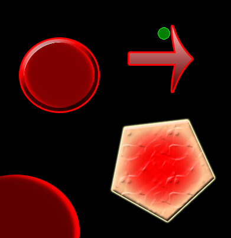



## Bounce off the walls\!

### Description

Bounce off the Wall! This program is similar to my 'bouncing balls' program; however this one bounces balls off walls of any angles. It is very realistic, and has no errors... I don’t think anyway. If you find one, then contact me!

Note that no API commands have been used to keep things simple! You can provide your own map just by replacing the default picture.

Enjoy.
 
### More Info
 

             |
---                |---
**Submitted On**   |2005-01-02 14:48:04
**By**             |[Niranjan Paudyal](https://github.com/Planet-Source-Code/PSCIndex/blob/master/ByAuthor/niranjan-paudyal.md)
**Level**          |Intermediate
**User Rating**    |4.6 (32 globes from 7 users)
**Compatibility**  |VB 5\.0, VB 6\.0
**Category**       |[Graphics](https://github.com/Planet-Source-Code/PSCIndex/blob/master/ByCategory/graphics__1-46.md)
**World**          |[Visual Basic](https://github.com/Planet-Source-Code/PSCIndex/blob/master/ByWorld/visual-basic.md)
**Archive File**   |[Bounce\_off183587122005\.zip](https://github.com/Planet-Source-Code/niranjan-paudyal-bounce-off-the-walls__1-58069/archive/master.zip)

